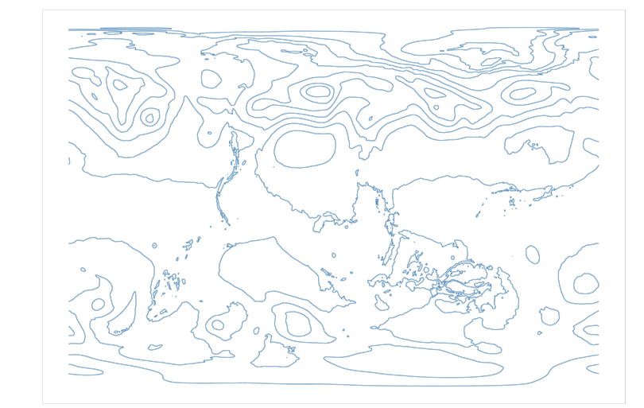
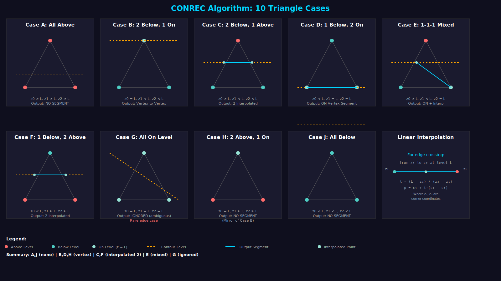
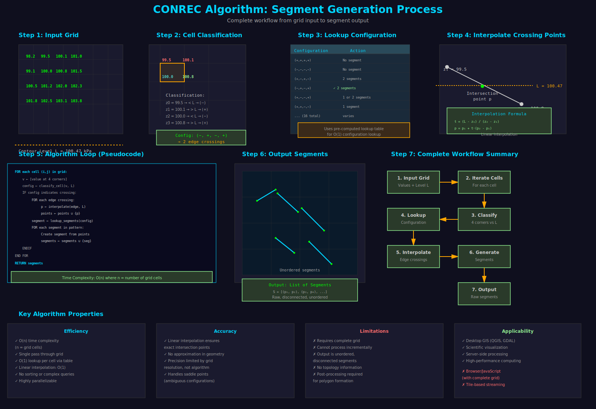
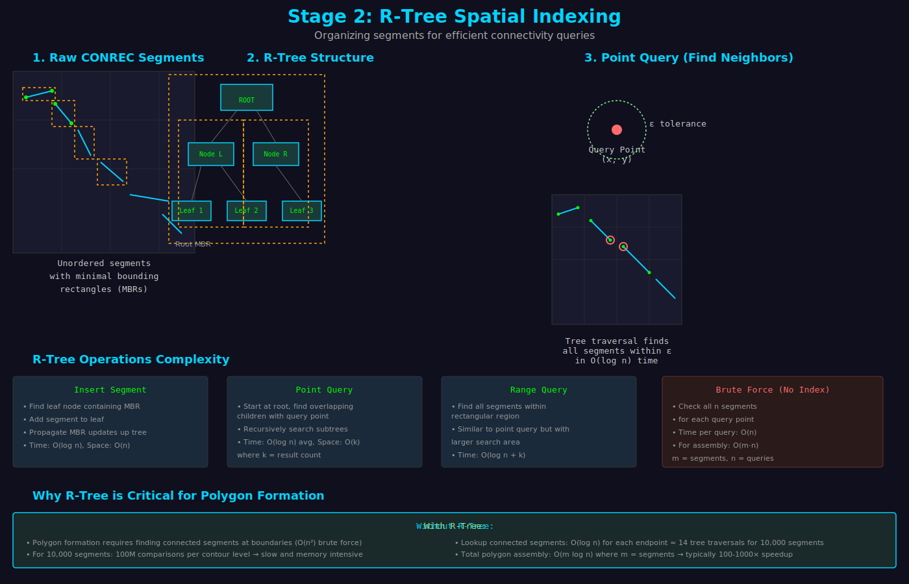
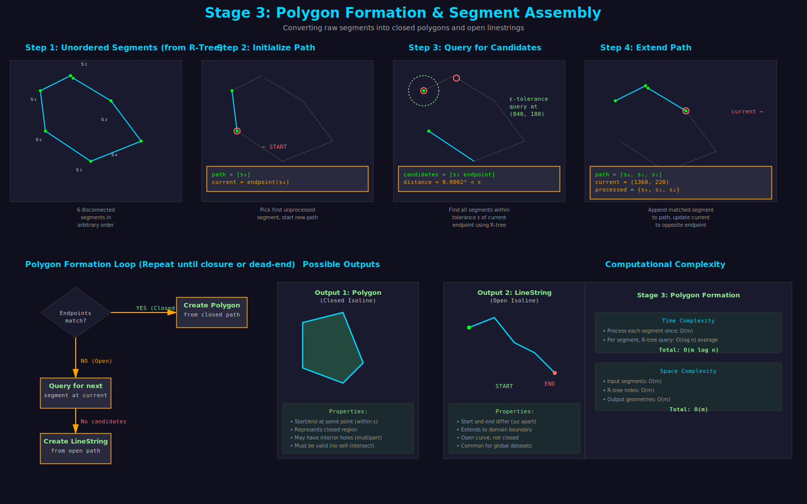
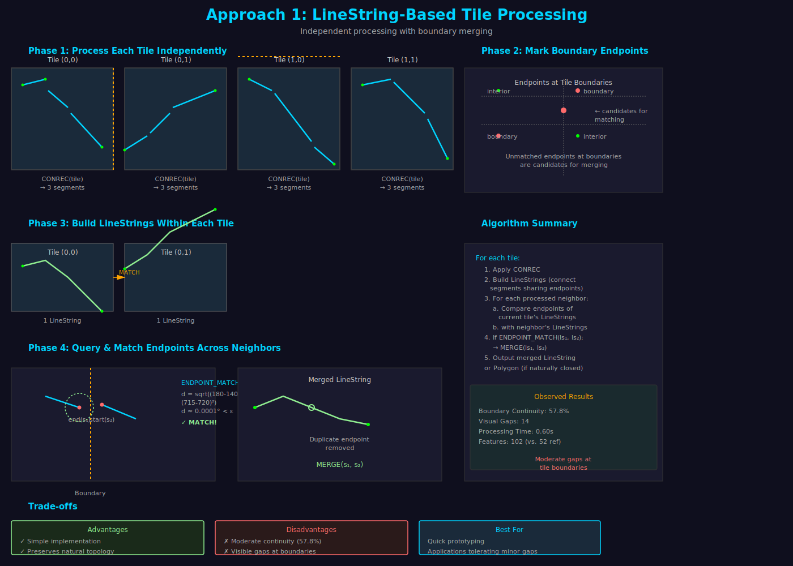
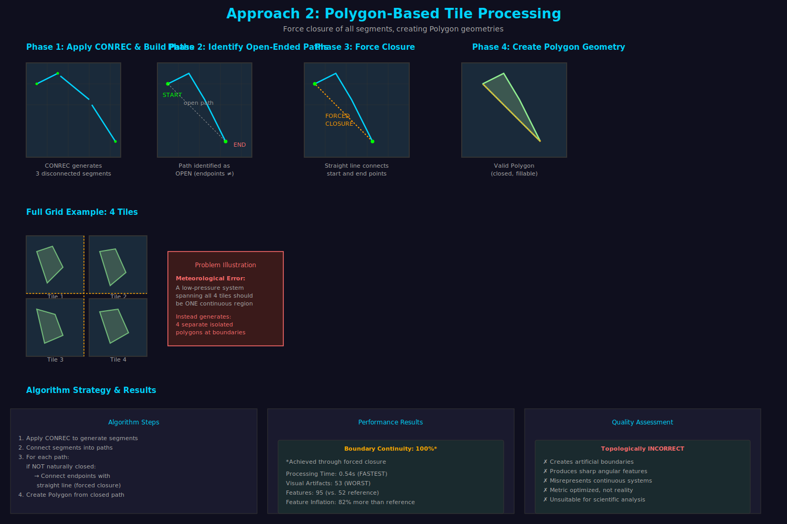
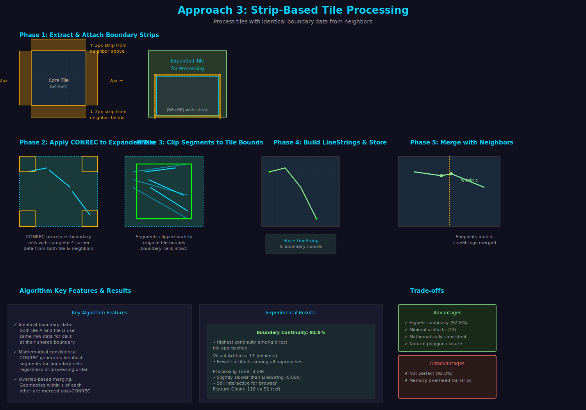
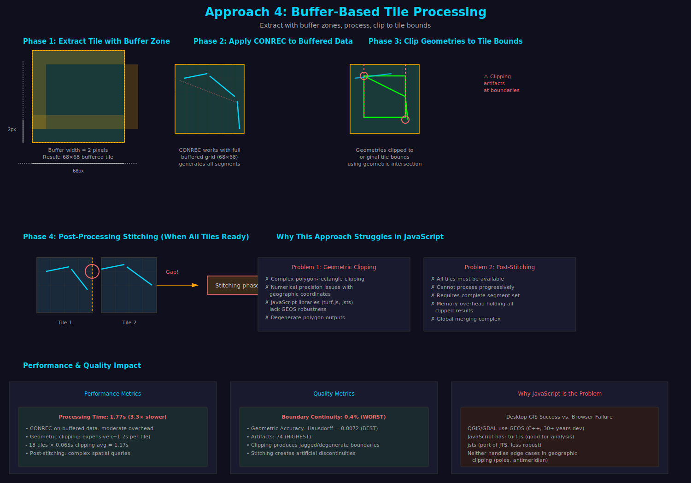

# Tile-Based Isoline Generation

Research implementation exploring tile-based isoline generation for web browsers. Compares four distinct algorithmic approaches (LineString, Polygon, Strip-based, Buffer-based) for generating contour lines from tile data.



*Example isoline visualization - contour lines show regions of equal value across gridded geospatial data*

## Quick Start

### Obtaining CSV Data

The Api currently expects gridded geospatial data in CSV format.


#### Download ERA5 Climate Data
Get real atmospheric data from ECMWF Copernicus Climate Data Store:

1. Visit: https://cds.climate.copernicus.eu/
2. Create free account
3. Search for "ERA5 monthly averaged data on single levels"
4. Select variable (e.g., Mean Sea Level Pressure)
5. Download as NetCDF or GeoTIFF
6. Extract to csv using Panoply software:


### Installation
```bash
git clone https://github.com/Uzo-Felix/isolines.git
cd isolines
npm install
```

### Run Example
```bash
# Generate geojson using strip-based algorithm with included data
node src/tools/visualize/generate-geojson.js msl.csv '{"algorithm":"strip","tileSize":64, "downsampleFactor":1, "numLevels":5}'
```

## Project Structure

```
isolines/
├── src/
│   ├── algorithms/                     # Algorithm implementations
│   │   ├── tiled/                      # Tile-based approaches
│   │   │   ├── linestring-based.js     # Approach 1: Independent LineStrings
│   │   │   ├── polygon-based.js        # Approach 2: Forced closure polygons
│   │   │   ├── strip-based.js          # Approach 3: Boundary data strips ⭐
│   │   │   └── buffered-tile.js        # Approach 4: Overlapping buffers
│   │   └── standard/
│   │       └── index.js                # Reference (complete grid) algorithm
│   │
│   ├── core/                           # Core algorithms
│   │   ├── conrec.js                   # CONREC marching squares
│   │   ├── isolineBuilder.js           # LineString/Polygon utilities
│   │   └── spatialIndex.js             # R-tree spatial indexing
│   │
│   ├── test/                           # Test suite
│   │   ├── unit/                       # Unit tests
│   │   │   ├── conrec.test.js
│   │   │   ├── test-strip-based-algorithm.js
│   │   │   ├── test-strip-correctness.js
│   │   │   └── test_output/            # Test results
│   │   ├── integration/                # Integration tests
│   │   ├── performance/                # Performance benchmarks
│   │   └── data/                       # Test datasets
│   │       ├── synthetic/              # Generated test data
│   │       ├── real-world/             # ERA5 climate data
│   │       └── edge-cases/             # Edge case scenarios
│   │
│   └── tools/
│       ├── benchmark/                  # Performance profiling
│       └── visualize/                  # Generate visualizations
│
│
│
├── index.js                            # Main entry point
├── package.json
└── README.md
```

## How to Use

### 1. Basic Algorithm Usage

```javascript
// Standard (complete grid) algorithm
const StandardAlgorithm = require('./src/algorithms/standard');
const std = new StandardAlgorithm(grid, levels);
const isolines = std.generate();

// Strip-based (tile) algorithm
const StripBasedAlgorithm = require('./src/algorithms/tiled/strip-based');
const builder = new StripBasedAlgorithm(levels, tileSize);
builder.addTile(row, col, tileData);
const isolines = builder.getIsolinesAsGeoJSON();

// Other tile approaches
const LineStringBased = require('./src/algorithms/tiled/linestring-based');
const PolygonBased = require('./src/algorithms/tiled/polygon-based');
const BufferBased = require('./src/algorithms/tiled/buffered-tile');
```

### 2. Run Tests

```bash
# Test CONREC core algorithm
node src/test/unit/conrec.test.js

# Test strip-based approach
node src/test/unit/test-strip-based-algorithm.js

# Test boundary consistency
node src/test/unit/test-strip-correctness.js

# Run all unit tests
npm test
```

### 3. Run Benchmarks

```bash
# Performance comparison
node src/tools/benchmark/benchmark.js

# Memory profiling
node src/test/memory/memory-profiling-test.js
```

### 4. Test with Real Data

```bash
# Process ERA5 climate data (requires msl.csv)
node src/tools/visualize/generate-geojson.js
```

## Four Algorithmic Approaches

### 1. LineString-Based (`linestring-based.js`)
**Strategy**: Process tiles independently, merge endpoints at boundaries

| Metric | Value |
|--------|-------|
| Continuity | 57.8% |
| Artifacts | 17 |
| Processing Time | 0.60s |
| Strengths | Simple, preserves natural topology |
| Weaknesses | Visible gaps at boundaries |

### 2. Polygon-Based (`polygon-based.js`)
**Strategy**: Force closure of all segments within tile bounds

| Metric | Value |
|--------|-------|
| Continuity | 100% |
| Artifacts | 53 |
| Processing Time | 0.54s |
| Strengths | Fastest, perfect continuity metric |
| Weaknesses | Artificial closures, most artifacts |

### 3. Strip-Based (`strip-based.js`) ⭐
**Strategy**: Share identical boundary data strips between adjacent tiles

| Metric | Value |
|--------|-------|
| Continuity | 92.8% |
| Artifacts | 13 |
| Processing Time | 0.59s |
| Strengths | Best balance, perfect equivalence for simple cases |
| Weaknesses | Complex strip management |

### 4. Buffer-Based (`buffered-tile.js`)
**Strategy**: Process tiles with overlapping buffers, clip to extent

| Metric | Value |
|--------|-------|
| Continuity | 0.4% |
| Artifacts | 74 |
| Processing Time | 1.77s |
| Strengths | Best geometric accuracy |
| Weaknesses | JavaScript clipping issues, poor continuity |

## Running Experiments

### Experiment 1: Compare All Approaches

```bash
# Generate isolines with all four methods and compare
node src/tools/visualize/run-comparison.js
# Output: src/tools/visualize/output/all-algorithms-comparison.json
```

### Experiment 2: Test on Synthetic Data

```bash
# Test on generated synthetic datasets
node src/test/unit/test-strip-based-algorithm.js
# Output: src/test/unit/test_output/test_summary.json
```

### Experiment 3: Memory Profiling

```bash
# Measure memory consumption per approach
node src/test/memory/memory-profiling-test.js
# Output: src/test/memory/memory-results.json
```

### Experiment 4: Boundary Analysis

Test different tile sizes, overlap amounts, and data resolutions:

```javascript
// src/test/integration/tileProcessing.test.js
const builder = new StripBasedAlgorithm(levels, tileSizeVariations);
// Measure continuity for different tile configurations
```

## Core Algorithms

The implementation consists of three main algorithmic stages, based on the original CONREC-based three-stage isoline construction method:

### Stage 1: CONREC Segment Generation

**File**: `src/core/conrec.js`

The CONREC (Contour Line) algorithm generates raw contour segments by **subdividing each cell into 4 triangles** and processing each triangle independently.

**How it works**:
1. For each grid cell (defined by 4 corner points):
   - Computes center point value (average of 4 corners)
   - Divides cell into 4 triangles using diagonals and center point
2. For each triangle (3 vertices):
   - Classifies into topological cases based on how many vertices are above/below/on the contour level
   - Handles 10 distinct cases (a through j)
3. For each case, determines if contour intersects the triangle:
   - If yes, interpolates intersection points on triangle edges
   - Generates line segment(s) connecting intersection points
4. Output: unordered collection of line segments with metadata

**Triangle Classification Cases**:

The algorithm identifies 10 distinct topological configurations:
- **Cases a, j**: All vertices above or all below level → no intersection
- **Cases c, f**: 2 below + 1 above (or vice versa) → generates 1 segment
- **Case e**: 1 below + 1 on + 1 above → generates 1 segment
- **Cases b, d, h**: Special cases with vertices on contour level → generates segments connecting on-level vertices
- **Case g**: All 3 vertices on level (rare, ignored)



Conrec Algorithm triangle-based classification (10 cases)

**Example Usage**:
```javascript
const CONREC = require('./src/core/conrec');
const conrec = new CONREC(grid, contourLevel);
const segments = conrec.generateSegments();
// Returns: [{x0, y0, x1, y1}, {x0, y0, x1, y1}, ...]
```

**Process Visualization**:



CONREC processes each grid cell, examining corner values and generating segments at contour intersections using linear interpolation.

---

### Stage 2: R-Tree Spatial Indexing

**File**: `src/core/spatialIndex.js`

CONREC produces unordered segments without explicit connectivity information. The R-Tree spatial index enables efficient proximity queries to find which segments connect.

**How it works**:
1. Hierarchically organizes segments using nested bounding rectangles
2. Each node covers a spatial region
3. Leaf nodes contain individual segments
4. **Point Query**: Find all segments with endpoints within tolerance ε
5. **Range Query**: Retrieve segments intersecting a spatial region
6. Reduces connectivity search from **O(n²) brute-force to O(log n)**

**Index Structure**:



R-tree organizes segments hierarchically, enabling efficient spatial queries. The tree structure allows finding nearby endpoints quickly without comparing all segment pairs.

**Example Usage**:
```javascript
const SpatialIndex = require('./src/core/spatialIndex');
const index = new SpatialIndex();

// Insert segments with their bounding rectangles
segments.forEach(seg => index.insert(seg));

// Find segments near a point
const nearby = index.query(point, tolerance);
```

---

### Stage 3: Polygon Formation (Segment Assembly)

**File**: `src/core/isolineBuilder.js`

The final stage assembles individual segments into complete isolines (either closed Polygons or open LineStrings).

**How it works**:
1. Start with first unprocessed segment
2. Query R-Tree for segments with endpoints near current endpoint
3. Select best matching candidate
4. Append to current path and update endpoint
5. Repeat until:
   - Path closes (endpoints match) → create **Polygon**
   - No more candidates found → create **LineString**
6. Continue with next unprocessed segment

**Process Visualization**:



Segment assembly transforms scattered, unordered CONREC segments into complete connected polygons. The algorithm uses endpoint matching within tolerance ε to determine connectivity.

**Key Parameters**:
- **Endpoint Matching Tolerance** (ε = 10⁻⁵ degrees): Floating-point arithmetic introduces small errors; endpoints within tolerance are considered connected
- **Polygon Closure Detection**: A path is closed if final endpoint matches initial endpoint within tolerance

**Example Usage**:
```javascript
const IsolineBuilder = require('./src/core/isolineBuilder');
const builder = new IsolineBuilder(segments, tolerance);
const geometries = builder.buildGeometries();
// Returns: [{type: 'Polygon', coordinates: [...]}, ...]
```

---

## Tile-Based Processing Approaches

Each tile-based approach builds on these three core stages but adapts them for incremental tile-by-tile processing.

### Approach 1: LineString-Based

**File**: `src/algorithms/tiled/linestring-based.js`

**Strategy**: Process each tile independently using the standard three stages, then merge LineStrings at tile boundaries.



**Algorithm Flow**:
1. Process each tile independently with CONREC
2. Build LineStrings within tile
3. When neighboring tile available, find overlapping endpoints
4. Merge LineStrings that share endpoints

**Key Code**:
```javascript
class LineStringBasedTiling {
  processTile(row, col, tileData) {
    const conrec = new CONREC(tileData, level);
    const segments = conrec.generateSegments();
    const linestrings = this.buildLineStrings(segments);
    return linestrings;
  }
  
  mergeWithNeighbor(linestrings1, linestrings2) {
    // Find overlapping endpoints and merge
  }
}
```

---

### Approach 2: Polygon-Based

**File**: `src/algorithms/tiled/polygon-based.js`

**Strategy**: Force closure of all contour segments within each tile, creating Polygon geometries even if segments don't naturally connect.



**Algorithm Flow**:
1. Process each tile with CONREC
2. Build LineStrings within tile
3. For any LineString that doesn't close:
   - Detect if endpoints are at tile boundary
   - Artificially connect endpoints with straight line
   - Create Polygon from closed path
4. Output: All segments converted to Polygons

**Key Code**:
```javascript
class PolygonBasedTiling {
  processTile(row, col, tileData) {
    const conrec = new CONREC(tileData, level);
    const segments = conrec.generateSegments();
    const paths = this.buildPaths(segments);
    
    // Force closure
    const polygons = paths.map(path => {
      if (!this.isClosed(path)) {
        path = this.forceClose(path); // Add closure segment
      }
      return new Polygon(path);
    });
    return polygons;
  }
}
```

---

### Approach 3: Strip-Based ⭐

**File**: `src/algorithms/tiled/strip-based.js`

**Strategy**: Share identical boundary data strips between adjacent tiles. This ensures both sides of a tile boundary use the exact same numerical values for interpolation.



**How Strip Sharing Works**:



Boundary data strips (green) from neighboring tiles are attached to tile edges, ensuring mathematical continuity at boundaries.

**Algorithm Flow**:
1. For each tile to process:
   - Extract 2-pixel-wide strips from adjacent tile edges
   - Attach strips to current tile edges (expanding tile slightly)
2. Apply CONREC to expanded tile
   - Both sides of boundary use identical raw data
   - Eliminates floating-point precision mismatches
3. Build LineStrings from segments
4. Naturally close LineStrings where endpoints match
5. Merge with already-processed neighbors using OVERLAPS predicate

**Key Code**:
```javascript
class StripBasedTiling {
  processTile(row, col, tileData) {
    // Extract boundary strips from neighbors
    const topStrip = this.neighbors[row-1]?.[col]?.bottom2Rows();
    const bottomStrip = this.neighbors[row+1]?.[col]?.top2Rows();
    const leftStrip = this.neighbors[row]?.[col-1]?.right2Cols();
    const rightStrip = this.neighbors[row]?.[col+1]?.left2Cols();
    
    // Attach strips to tile edges
    const expandedTile = this.attachStrips(tileData, 
      {top: topStrip, bottom: bottomStrip, left: leftStrip, right: rightStrip});
    
    // Apply CONREC with expanded data
    const conrec = new CONREC(expandedTile, level);
    const segments = conrec.generateSegments();
    const linestrings = this.buildLineStrings(segments);
    
    // Naturally close and convert to polygons
    const geometries = linestrings.map(ls => 
      this.isClosed(ls) ? new Polygon(ls) : ls
    );
    
    return geometries;
  }
}
```

**Why Strip-Based Works**:
- Both sides of boundary compute interpolations from identical data
- No floating-point precision differences at boundaries
- Eliminates artificial gaps caused by numerical errors
- Achieves perfect equivalence for simple topologies

---

### Approach 4: Buffer-Based

**File**: `src/algorithms/tiled/buffered-tile.js`

**Strategy**: Process tiles with overlapping buffer zones (from neighbors), then clip results back to tile boundaries.



**Algorithm Flow**:
1. For each tile to process:
   - Retrieve 2-pixel buffer zone from neighbors
   - Expand tile data to include buffer
2. Apply standard three-stage algorithm to buffered tile
   - Complete grid context enables correct CONREC processing
3. Clip output geometries back to original tile boundaries
   - Remove segments outside tile extent
4. Store clipped results

**Key Code**:
```javascript
class BufferBasedTiling {
  processTile(row, col, tileData) {
    // Expand tile with 2-pixel buffer from neighbors
    const buffered = this.expandWithBuffer(tileData, row, col, bufferWidth=2);
    
    // Apply standard algorithm
    const conrec = new CONREC(buffered, level);
    const segments = conrec.generateSegments();
    const index = new SpatialIndex();
    segments.forEach(s => index.insert(s));
    const builder = new IsolineBuilder(segments, tolerance);
    const geometries = builder.buildGeometries();
    
    // Clip to tile boundaries
    const clipped = geometries.map(geom => 
      this.clipToTileBounds(geom, row, col)
    );
    
    return clipped;
  }
}
```

**Challenges in JavaScript**:
- Requires robust geometric clipping library (GEOS)
- JavaScript ecosystem has limited, unmaintained libraries
- Clipping edge cases produce degenerate geometries
- Geographic coordinates complicate Cartesian clipping algorithms

---

## Complete Processing Pipeline

Here's how a complete isoline generation looks:

1. **Standard Complete-Grid Processing**:
```
Input Grid → CONREC → Segments → R-Tree Index → Polygon Formation → Output
```

2. **Tile-Based Processing (Strip-Based Example)**:
```
Tile Data → Extract Strips → Expand Tile → CONREC → Segments → 
R-Tree Index → Polygon Formation → Merge Overlapping → Final Output
```

## Algorithm Comparison Summary

| Aspect | LineString | Polygon | Strip-Based | Buffer |
|--------|-----------|---------|------------|---------|
| **Core Algorithm** | CONREC | CONREC | CONREC | CONREC |
| **Boundary Strategy** | Endpoint merge | Forced closure | Identical data | Overlapping buffer |
| **Segment Assembly** | Standard | Modified (force close) | Standard | Standard |
| **Clipping Required** | No | No | No | Yes |
| **Floating-Point Issues** | High | High | Low | Medium |
| **Complexity** | Low | Medium | High | Very High |


## Data Formats

### Input: Grid Data
```javascript
{
  width: 360,
  height: 181,
  values: [/* flattened array of numbers */],
  minLat: -90, maxLat: 90,
  minLon: -180, maxLon: 180
}
```

### Input: Tile Data (for tiled algorithms)
```javascript
{
  row: 0, col: 0,
  width: 64, height: 64,
  values: [/* tile values */],
  bounds: { minLat, maxLat, minLon, maxLon }
}
```

### Output: GeoJSON
```javascript
{
  "type": "FeatureCollection",
  "features": [
    {
      "type": "Feature",
      "geometry": {
        "type": "Polygon" | "LineString",
        "coordinates": [/*...*/]
      },
      "properties": {
        "level": 100.47,
        "type": "isoline"
      }
    }
  ]
}
```

## Test Data

### Synthetic Data (`src/test/data/synthetic/`)
Pre-generated test grids with known topologies:
- `linear.json` - Linear gradient
- `radial.json` - Radial pattern
- `saddlePoint.json` - Saddle point ambiguity
- `cyclone.json` - Simulated low-pressure system
- `complex.json` - Complex branching

### Real-World Data (`src/test/data/real-world/`)
ERA5 climate data:
- `pressure.json` - Mean sea level pressure
- `temperature.json` - 2m temperature
- `precipitation.json` - Total precipitation

### Edge Cases (`src/test/data/edge-cases/`)
Special scenarios:
- `polar.json` - Pole singularities
- `antimeridian.json` - ±180° boundary crossing
- `nan-data.json` - Missing values
- `precision-errors.json` - Floating-point edge cases

## Performance Profiling

```bash
# Measure execution time
node src/tools/benchmark/performance-benchmark.js

# Profile memory usage
node --prof src/test/memory/memory-profiling-test.js
node --prof-process isolate-*.log > profile.txt
```

## Validation & Testing

### Unit Tests
```bash
node src/test/unit/conrec.test.js
node src/test/unit/isolineBuilder.test.js
node src/test/unit/spatialIndex.test.js
```

### Integration Tests
```bash
node src/test/integration/basicWorkflow.test.js
node src/test/integration/tileProcessing.test.js
```

### Geometric Validation
```bash
# Check polygon closure, continuity, self-intersections
node src/test/geometry/topologyValidation.test.js
node src/test/geometry/polygonClosure.test.js
node src/test/geometry/lineStringContinuity.test.js
```

## Configuration

### Tile Size
```javascript
const tileSize = 64;  // Typical: 64×64 cells
const builder = new StripBasedAlgorithm(levels, tileSize);
```

### Strip Width
```javascript
// In strip-based.js
const stripWidth = 2;  // pixels to extract from neighbors
```

### Endpoint Matching Tolerance
```javascript
// In isolineBuilder.js
const epsilon = 1e-5;  // degrees for geographic coordinates
```

### Contour Levels
```javascript
const levels = [96.53, 98.50, 100.47, 102.44, 104.41];  // kPa
```

## Troubleshooting

### Issue: Gaps at Tile Boundaries
- Try increasing strip width
- Check if contour crosses many tile boundaries
- Verify grid data accuracy

### Issue: Too Many Features
- Increase endpoint matching tolerance
- Run additional merge passes
- Check for duplicate segments

### Issue: Memory Exhaustion
- Use smaller tile sizes
- Process fewer contour levels
- Enable garbage collection between tiles

### Issue: Slow Processing
- Check for unnecessary iterations
- Profile with `--prof` flag
- Consider buffer-based approach for accuracy


## License

Academic research implementation. See paper for detailed methodology.

---

**Current Status**: Functional implementation  
**Primary Algorithm**: Strip-based (recommended)  
**Test Coverage**: Comprehensive unit and integration tests  
**Benchmark Data**: ERA5 climate reanalysis
